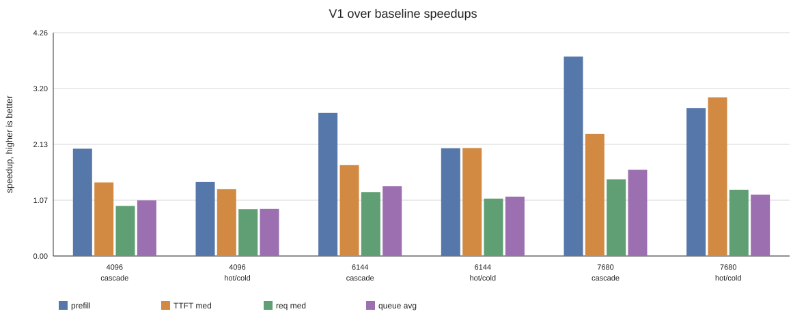
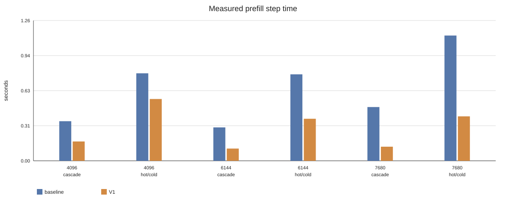
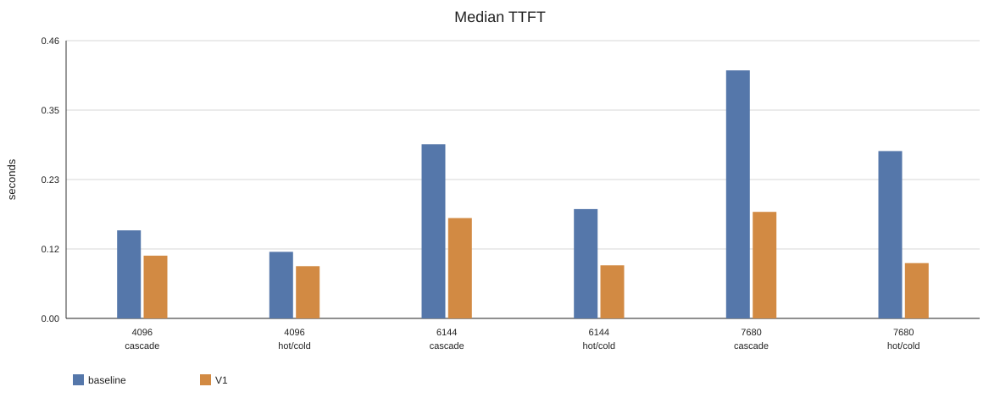
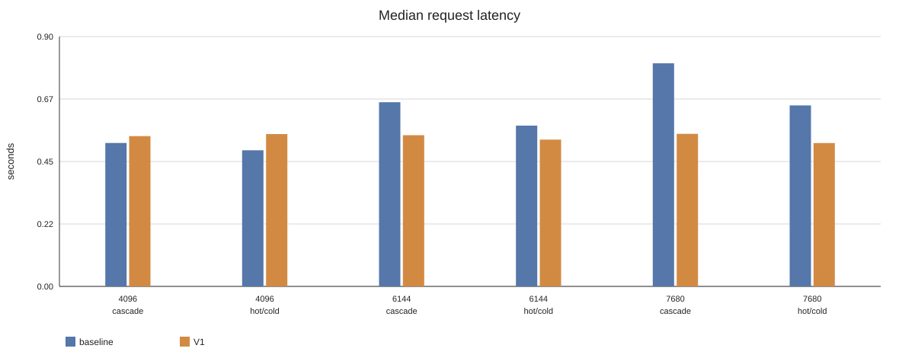
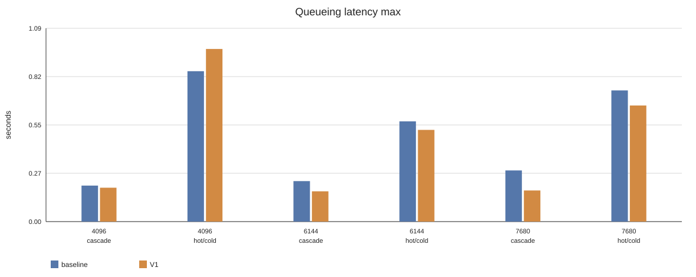
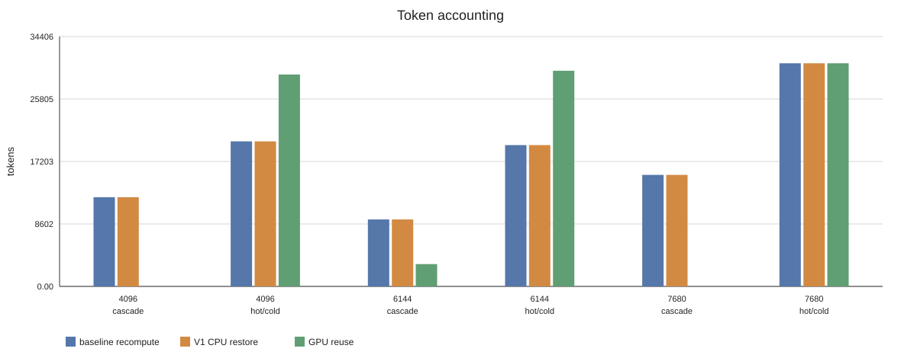

# nano-vLLM GPU+CPU Prefix Cache 进展

## 研究方向

目标：把 nano-vLLM 现有 GPU prefix cache 扩展为 GPU + CPU 两级 prefix cache。

请求查找 prefix KV 时：

```text
GPU hit              -> 直接复用 GPU KV
GPU miss + CPU hit   -> H2D restore 到 GPU，跳过 prefix prefill
GPU miss + CPU miss  -> 正常 prefill / recompute
```

约束：模型权重始终完整驻留 GPU，只人为限制 GPU KV cache capacity；第一阶段不考虑 SSD、不引入 ShareGPT、不把 preemption-driven swapping 作为主实验。

实现上需要贴合 nano-vLLM 当前 block 抽象：`BlockManager` 管理的是 logical block，一个 logical block id 对应所有 layer 的 K/V slice。

```text
kv_cache shape = [K/V][layer][block_id][token_offset][kv_head][head_dim]
Qwen3-8B: 1 logical block = 256 tokens = 36 MiB 全层 KV
```

## 环境

```text
GPU: NVIDIA H200 NVL
Model: /data/datasets/models-hf/Qwen3-8B
venv: .venv-fa28
Python: 3.10.19
Torch: 2.8.0+cu128
FlashAttention: 2.8.3.post1
```

说明：`.venv-fa28` 中已有匹配的 `flash-attn` wheel，后续 benchmark 优先使用该环境，避免本地编译。

## 代码入口

```text
bench_long_doc_qa.py
scripts/run_prefix_cache_cases.sh
```

`bench_long_doc_qa.py` 负责生成 synthetic long-doc / branching workload，并输出 JSON metrics。`scripts/run_prefix_cache_cases.sh` 负责批量跑 baseline 与 V1，并为每个 case 生成 `summary.json`。

## V1 实现

V1 已实现 CPU prefix cache backing store，重点是 correctness 和可观测性，暂不做 scheduler-aware prefetch / OPT eviction。

核心路径：

- prompt prefill 完成后，完整 prefix blocks 立刻 async D2H 写回 CPU。
- decode 新生成 tokens 暂不主动纳入 prefix cache；后续请求重新 prefill 成完整 block 后再进入 cache。
- 写回前用 block hash + token ids 去重：CPU 已有或正在 pending writeback 时跳过。
- waiting request 调度时查最长连续 prefix：GPU hit 直接复用，CPU hit 分配 GPU block 并同步 H2D restore，miss 后剩余 token 正常 prefill。
- pending writeback 的 GPU block 会被保护，D2H 完成后再释放；V1 选择优先保证正确性。

已验证 smoke test：

| 场景 | 结果 |
|---|---|
| 重复 prompt 写回 | 第二次请求不会重复 D2H，同一 prefix block 写回去重生效 |
| `D0 -> D1 -> D0` 小 GPU cache | 第三次 `D0` GPU miss + CPU hit，可 H2D restore 并跳过 prefix prefill |

## Workload Cases

当前参考 LMCache Long-Document QA 的 workload 语义，但文档内容使用 synthetic token IDs。warmup 阶段访问所有 reusable prefixes，不计入最终指标；measured 阶段访问相同 prefix + 不同 query suffix。

| case | 目的 | 访问特征 |
|---|---|---|
| `case0_functional` | 单文档功能性校验 | 同一 document 做两次 QA，第二次应命中 GPU prefix cache |
| `cascade_tile` | 级联污染 / cache thrashing sanity | warmup `D0,D1,...`，query 再从 `D0` 开始；working set 大于 GPU cache 时容易连续 miss |
| `hot_cold_sharing` | 冷热 document prefix sharing | hot documents 高频访问，cold documents 低频访问；同时出现 GPU hit 和 GPU miss |

## 实验结果

### Poisson Serving Benchmark

本轮主结果目录：

```text
exp/doclen_sweep_maincases_20260831_085500/
```

这轮替换旧的短 prefix / branching 扫描：默认只跑 `document_length >= 4096`，主流程只保留 `case0_functional`、`cascade_tile`、`hot_cold_sharing`。measured 阶段使用 Poisson arrival，主 case 使用 `max_num_seqs=8` 和 continuous batching。

配置：

```text
model = /data/datasets/models-hf/Qwen3-8B
runs = 3
document_length = 4096 / 6144 / 7680
query_length = 96
output_len = 16
target_working_set_gb = 1.5
gpu_kv_cache_gb = 1.1
request_rate = 1.0 req/s
main max_num_seqs = 8
main max_num_batched_tokens = 4 * (document_length + query_length)
```

指标口径：`request_latency_*`、`ttft_latency_*`、`queueing_latency_*` 都是 measured request 的分布统计；`prefill_step_time_sec` 是 measured 阶段所有 prefill step 的总 wall time，用来衡量系统 prefill 工作量，不是单请求 latency。

图表：













核心结果均为 3 次运行均值：

| doc len | case | reqs | GPU reuse B/V1 | recompute -> restore | prefill total B/V1 | TTFT median B/V1 | TTFT min B/V1 | request median B/V1 | queue avg B/V1 | queue max B/V1 |
|---:|---|---:|---:|---:|---:|---:|---:|---:|---:|---:|
| 4096 | case0 | 1 | 4096 / 4096 | 0 -> 0 | 0.048 / 0.048 s | 0.076 / 0.075 s | 0.076 / 0.075 s | 0.452 / 0.453 s | 0.00003 / 0.00003 s | 0.00003 / 0.00003 s |
| 4096 | cascade | 3 | 0 / 0 | 12288 -> 12288 | 0.355 / 0.173 s | 0.147 / 0.105 s | 0.145 / 0.082 s | 0.514 / 0.539 s | 0.068 / 0.064 s | 0.204 / 0.192 s |
| 4096 | hot/cold | 12 | 29184 / 29184 | 19968 -> 19968 | 0.784 / 0.554 s | 0.111 / 0.087 s | 0.063 / 0.070 s | 0.488 / 0.546 s | 0.147 / 0.163 s | 0.852 / 0.977 s |
| 6144 | case0 | 1 | 6144 / 6144 | 0 -> 0 | 0.054 / 0.049 s | 0.083 / 0.076 s | 0.083 / 0.076 s | 0.493 / 0.450 s | 0.00003 / 0.00003 s | 0.00003 / 0.00003 s |
| 6144 | cascade | 2 | 3072 / 3072 | 9216 -> 9216 | 0.299 / 0.110 s | 0.291 / 0.168 s | 0.179 / 0.086 s | 0.661 / 0.542 s | 0.115 / 0.086 s | 0.229 / 0.172 s |
| 6144 | hot/cold | 8 | 29696 / 29696 | 19456 -> 19456 | 0.774 / 0.377 s | 0.183 / 0.089 s | 0.065 / 0.065 s | 0.577 / 0.526 s | 0.096 / 0.085 s | 0.568 / 0.519 s |
| 7680 | case0 | 1 | 7680 / 7680 | 0 -> 0 | 0.055 / 0.054 s | 0.085 / 0.084 s | 0.085 / 0.084 s | 0.509 / 0.475 s | 0.00004 / 0.00003 s | 0.00004 / 0.00003 s |
| 7680 | cascade | 2 | 0 / 0 | 15360 -> 15360 | 0.481 / 0.127 s | 0.414 / 0.178 s | 0.268 / 0.094 s | 0.800 / 0.547 s | 0.145 / 0.088 s | 0.290 / 0.176 s |
| 7680 | hot/cold | 8 | 30720 / 30720 | 30720 -> 30720 | 1.122 / 0.398 s | 0.280 / 0.092 s | 0.064 / 0.065 s | 0.649 / 0.514 s | 0.156 / 0.133 s | 0.743 / 0.657 s |

Speedup：

| doc len | case | prefill total | TTFT median | request median | queue avg | queue max |
|---:|---|---:|---:|---:|---:|---:|
| 4096 | cascade | 2.05x | 1.40x | 0.95x | 1.06x | 1.06x |
| 4096 | hot/cold | 1.42x | 1.27x | 0.89x | 0.90x | 0.87x |
| 6144 | cascade | 2.73x | 1.74x | 1.22x | 1.33x | 1.33x |
| 6144 | hot/cold | 2.06x | 2.06x | 1.10x | 1.13x | 1.09x |
| 7680 | cascade | 3.80x | 2.33x | 1.46x | 1.64x | 1.64x |
| 7680 | hot/cold | 2.82x | 3.03x | 1.26x | 1.17x | 1.13x |

观察：

- `case0` 只验证 GPU prefix hit 链路，baseline 和 V1 基本一致，不用于展示 CPU restore 收益。
- `cascade` 是容量压力最强的 case：4096/7680 下 GPU reuse 为 0，6144 下只残留 3072 token；V1 能把 baseline 的 recompute token 转成 CPU restore。
- `hot/cold` 同时存在 GPU reuse 和 GPU miss；baseline 与 V1 的 GPU reuse token 一致，说明 V1 没有牺牲原有 GPU prefix cache，只是在 miss 时补 CPU restore。
- prefix 越长，V1 的 prefill total 改善越明显；TTFT/request latency 的改善较小，因为它们还包含排队、query suffix prefill、first-token decode 和后续 decode。
- Poisson arrival 下 median queue 很低，但 max queue 会被局部 burst 放大，因此文档里保留 avg/max 而不把单次 tail 当稳定结论。

### Restore Profile 与带宽检查

Profile 目录：

```text
exp/profile_v1_restore_20260830/
```

`document_length = 6144`、`cascade_tile`、`repeat_count = 1` 的拆分：

| mode | restore H2D | scheduler total | model CUDA prefill | model runner prefill wall | prefill step | request median | TTFT median |
|---|---:|---:|---:|---:|---:|---:|---:|
| baseline | 0.000 s | 0.002 s | 0.552 s | 0.556 s | 0.557 s | 1.226 s | 0.828 s |
| V1 | 0.054 s | 0.065 s | 0.110 s | 0.112 s | 0.167 s | 0.937 s | 0.551 s |

V1 的 `restore_latency_sum = 0.054s` 只统计 KV H2D copy；`prefill_step_time = 0.167s` 还包含 restore 后的 96-token query suffix forward。剩余约 0.11s 主要是 GPU prefill attention，不是 CPU 处理开销。

本机 host-device pinned copy 带宽：

| size | H2D avg / median | D2H avg / median |
|---:|---:|---:|
| 64 MiB | 14.03 / 14.05 GB/s | 48.12 / 48.08 GB/s |
| 256 MiB | 19.83 / 19.76 GB/s | 41.31 / 41.30 GB/s |
| 1024 MiB | 38.62 / 38.90 GB/s | 33.69 / 33.69 GB/s |
| 2048 MiB | 49.49 / 49.59 GB/s | 31.89 / 31.88 GB/s |

`nvidia-smi topo -m` 显示 GPU 到 CPU 是 `NODE` 路径，不是 NVLink。V1 restore 读 2.72 GB 用 0.054s，折算约 50.6 GB/s，和大块 H2D 带宽测试吻合。

### 旧版 Sanity 结果

旧实验目录：

```text
exp/doclen_sweep_v1_vs_recompute_queue_20260830_100635/
```

这组实验使用一次性批量提交，并且 `max_num_seqs=1`，会人为制造很重的排队时间。现在只保留为 sanity：它证明了 prefix 越长，V1 把 recompute 转成 restore 后 prefill 路径收益越明显；但不再作为主 serving benchmark 结论。

## 下一步

1. 把当前 V1 作为 baseline 对照，继续扩大 prefix length / working set，观察 H2D restore 与 recompute 的边界。
2. 拆出更细的 restore 开销：H2D latency、CPU KV resident bytes、restore blocks/token 分布。
3. 实现 V2 scheduler-aware prefetch：当前 request 运行时，提前把后续 CPU-resident prefix copy 回 GPU。
4. 实现 OPT-like eviction oracle：根据后续访问序列驱逐最晚再访问的 prefix block，用于评估调度与 cache 协同收益上界。
5. 控制 pending writeback backpressure，避免 protected blocks 在高压力场景下长期占用 GPU cache。
