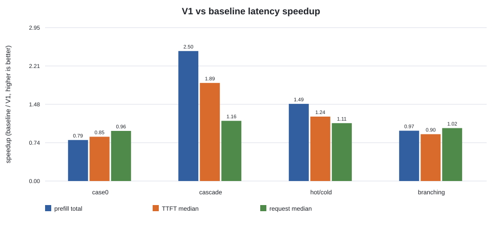
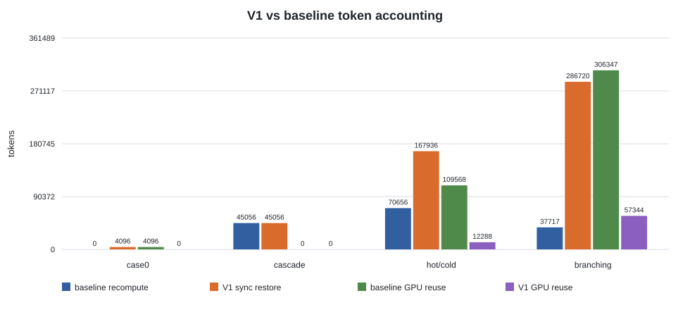
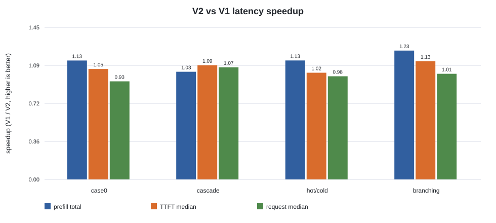
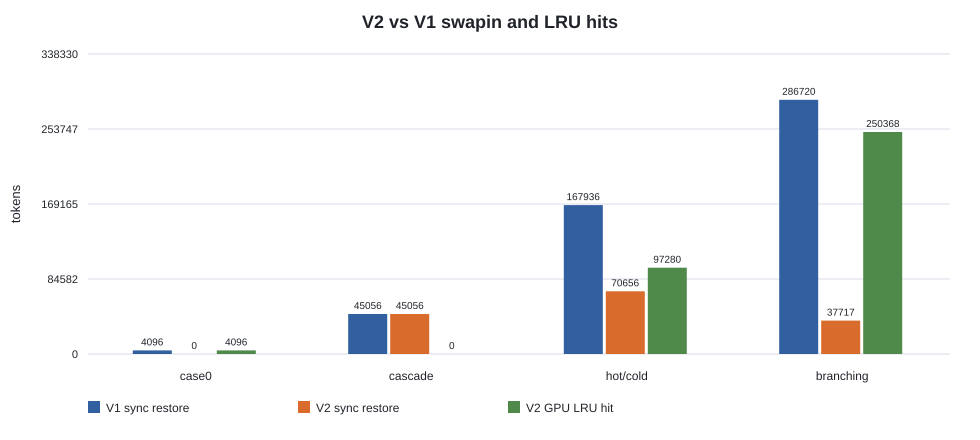

# nano-vLLM GPU+CPU Prefix Cache 进展

## 研究方向

目标：把 nano-vLLM 现有 GPU prefix cache 扩展为 GPU + CPU 两级 prefix cache。

请求查找 prefix KV 时：

```text
GPU hit              -> 直接复用 GPU KV
GPU miss + CPU hit   -> H2D restore 到 GPU，跳过 prefix prefill
GPU miss + CPU miss  -> 正常 prefill / recompute
```

约束：模型权重始终完整驻留 GPU，只人为限制 GPU KV cache capacity；第一阶段不考虑 SSD、不引入 ShareGPT、不把 preemption-driven swapping 作为主实验。

实现上需要贴合 nano-vLLM 当前 block 抽象：`BlockManager` 管理的是 logical block，一个 logical block id 对应所有 layer 的 K/V slice。

```text
kv_cache shape = [K/V][layer][block_id][token_offset][kv_head][head_dim]
Qwen3-8B: 1 logical block = 256 tokens = 36 MiB 全层 KV
```

## 环境

```text
GPU: NVIDIA H200 NVL
Model: /data/datasets/models-hf/Qwen3-8B
venv: .venv-fa28
Python: 3.10.19
Torch: 2.8.0+cu128
FlashAttention: 2.8.3.post1
```

说明：`.venv-fa28` 中已有匹配的 `flash-attn` wheel，后续 benchmark 优先使用该环境，避免本地编译。

## 代码入口

```text
bench_long_doc_qa.py
scripts/run_prefix_cache_cases.sh
```

`bench_long_doc_qa.py` 负责生成 synthetic long-doc / branching workload，并输出 JSON metrics。`scripts/run_prefix_cache_cases.sh` 负责批量跑 baseline / V1 / V2，并为每个 case 生成 `summary.json`。

## V1 实现

V1 已实现 CPU prefix cache backing store，重点是 correctness 和可观测性。

核心路径：

- prompt prefill 完成后，完整 prefix blocks 立刻 async D2H 写回 CPU。
- decode 新生成 tokens 暂不主动纳入 prefix cache；后续请求重新 prefill 成完整 block 后再进入 cache。
- 写回前用 block hash + token ids 去重：CPU 已有或正在 pending writeback 时跳过。
- waiting request 调度时查最长连续 prefix：GPU hit 直接复用，CPU hit 分配 GPU block 并同步 H2D restore，miss 后剩余 token 正常 prefill。
- pending writeback 的 GPU block 会被保护，D2H 完成后再释放；V1 选择优先保证正确性。

已验证 smoke test：

| 场景 | 结果 |
|---|---|
| 重复 prompt 写回 | 第二次请求不会重复 D2H，同一 prefix block 写回去重生效 |
| `D0 -> D1 -> D0` 小 GPU cache | 第三次 `D0` GPU miss + CPU hit，可 H2D restore 并跳过 prefix prefill |

## V2 实现：GPU LRU Retention

V2 已实现。它不做调度感知预取，目标是把 V1 中“request 结束后 GPU KV 是否还能复用”的随缘行为，改成明确的 inactive GPU prefix cache policy。

核心语义：

```text
active block   = 正在被 running / waiting request 引用，不能淘汰
inactive block = request 已结束或释放引用，KV 仍在 GPU，hash 仍有效，可作为 GPU prefix cache 命中
free block     = 没有有效 cache 内容，或已经被 LRU eviction 选中可覆盖
```

V2 路径：

- request prefill 完成后仍按 V1 主动 async D2H 写回 CPU backing。
- request finish 后，完整 prefix blocks 不立刻进入普通 free list，而是进入 inactive GPU LRU。
- 释放同一个 request 的 blocks 时按逆序入队：tail prefix 先进入 LRU/free queue，在相同 recency 下更早被淘汰；靠近 prefix 根部的 block 更通用，因此尽量留久一点。这个策略对齐 vLLM 的 prefix-aware LRU 细节。
- 新 request prefix lookup 时，如果命中 inactive block，则从 LRU 中移出并重新变成 active GPU hit。
- 需要新 GPU block 时，优先使用真正空闲 block；不够时从 inactive LRU 端驱逐 victim；仍不够时才进入现有 preemption 路径。
- eviction 优先选择已经 CPU-backed 的 inactive block；没有 CPU backing 的 inactive block 只有在空间仍不足时才被淘汰。
- pending writeback 已改成 block 粒度：已完成 D2H 的 block 可以先进入 CPU-backed LRU/可淘汰集合，未完成 D2H 的 block 继续 protected。

V2 重点指标：

```text
gpu_prefix_miss_request_count
cpu_sync_swapin_request_count
cpu_sync_swapin_block_count
cpu_sync_swapin_token_count
cpu_prefix_restore_latency_sum
gpu_lru_hit_block_count
gpu_lru_hit_token_count
gpu_lru_eviction_count
gpu_lru_cached_block_count
gpu_lru_cached_block_peak
```

预期收益：相比 V1，V2 不是 overlap H2D，而是减少同步 swapin 次数、H2D bytes 和 H2D latency，同时提升 GPU prefix reuse。

## V3 设计：调度感知 Prefetch / OPT

调度感知预取推迟到 V3。V3 在 V2 LRU 的基础上 inspect waiting queue，预测即将访问的 CPU-resident prefix，并用 async H2D 提前恢复到 GPU。

V3 的指标口径需要区分 demand sync swapin 和 prefetch restore：`cpu_sync_swapin_*` 只统计关键路径上的 GPU miss + CPU hit + 同步 H2D；如果 prefetch 已经把 block 提前恢复到 GPU，后续 request 应计为 GPU hit，而不是 sync swapin。

V3 还需要统计 prefetch 预测质量，避免只看 latency 看不出策略问题：

- prefetch true positive：提前取回后被后续 request 实际命中的 block。
- prefetch false positive：提前取回但在被淘汰前没有被使用的 block，即取多了。
- prefetch false negative：request 到达关键路径时仍发生 CPU hit + 同步 H2D，本应提前取但没取到，即取少了。
- prefetch useful tokens / wasted tokens：按 token 维度统计有效预取和浪费预取，便于和 H2D bytes、latency 对齐。

V3 中 OPT/Oracle 的定位是评估上界：根据未来访问序列选择最晚再访问或不再访问的 inactive block 作为 victim。第一版 V3 不应为了 speculative prefetch 抢占 running request；preemption 只保留给 demand path。

## Workload Cases

当前参考 LMCache Long-Document QA 的 workload 语义，但文档内容使用 synthetic token IDs。warmup 阶段访问所有 reusable prefixes，不计入最终指标；measured 阶段访问相同 prefix + 不同 query suffix。

| case | 目的 | 访问特征 |
|---|---|---|
| `case0_functional` | 单文档功能性校验 | 同一 document 做两次 QA，第二次应命中 GPU prefix cache |
| `cascade_tile` | 级联污染 / cache thrashing sanity | warmup `D0,D1,...`，query 再从 `D0` 开始；working set 大于 GPU cache 时容易连续 miss |
| `hot_cold_sharing` | 冷热 document prefix sharing | hot documents 高频访问，cold documents 低频访问；同时出现 GPU hit 和 GPU miss |

## V2 Benchmark 参数原则

V2 LRU 要测的是 GPU inactive prefix cache 是否能减少 CPU swapin，而不是单个超长 request 把 GPU KV 撑爆。因此后续主实验按下面原则调参：

大白话：用更多不同 document 扩大总 working set，同时降低单个 request 的 KV 占比。不要主要依赖少量超长 document 制造 cache pressure。

需要同时控制两个比例：

```text
single_prompt_KV / GPU_KV
working_set_KV / GPU_KV
```

含义：

- `single_prompt_KV / GPU_KV`：一个 request 的 prompt/query/decode 最多占多少 GPU KV。它决定 continuous batching 是否还有空间、inactive LRU 是否有空间留住历史 prefix。目标先放在 `0.25-0.4`。
- `working_set_KV / GPU_KV`：所有可复用 document prefix 的总 KV 量相对 GPU KV cache 的大小。它决定是否有长期 cache pressure。目标先放在 `2-4`。

调参顺序：

1. 固定 `document_length >= 4096`，但避免单个 prompt 占据 GPU KV 的大部分。
2. 根据目标 `single_prompt_KV / GPU_KV` 选择 `gpu_kv_cache_gb`。
3. 根据目标 `working_set_KV / GPU_KV` 自动计算 `num_documents`，优先增加 document 数量，而不是继续拉长 document。
4. 使用 Poisson arrival、`max_num_seqs=8`、合适的 `max_num_batched_tokens` 跑 serving 场景，确认确实在 continuous batching 下比较 recompute baseline 与 V2 LRU。

粗略公式：

```text
single_prompt_KV ~= (document_length + query_length + output_len) * kv_bytes_per_token
working_set_KV ~= num_documents * reusable_prefix_length * kv_bytes_per_token
```

当前参数检查：Qwen3-8B bf16 的 KV 约为 `144 MiB / 1K tokens`。旧版 `gpu_kv_cache_gb=1.1` 实际只有约 `1.09 GB` KV blocks，因此单请求占比偏高：

| document length | single prompt KV | single_prompt_KV / GPU_KV | 粗略可同时容纳完整 prompt 数 |
|---:|---:|---:|---:|
| 4096 | 0.578 GB | 0.53 | 1 |
| 6144 | 0.859 GB | 0.79 | 1 |
| 7680 | 1.070 GB | 0.98 | 1 |

这个配置可以触发 recompute/restore，但不适合作为 V2 LRU 主实验：GPU 几乎没有空间同时容纳 active requests 和 inactive prefix，LRU 会退化成频繁 swapin/swapout。

后续 benchmark 需要把 `num_documents` 作为由 working set ratio 自动推导的参数，而不是写死。`bench_long_doc_qa.py` 已在 JSON 中输出 `working_set_to_gpu_kv_ratio`、`single_prompt_to_gpu_kv_ratio` 和 `single_prompt_fit_count_est`，用于检查每轮参数是否落在目标范围。

建议先保留两个主档位：

| profile | 目的 | 建议参数 |
|---|---|---|
| `moderate_lru` | 干净验证 V2 LRU 是否减少同步 swapin | `document_length=4096`, `gpu_kv_cache_gb≈2.0`, `target_working_set_gb≈6.0`, `max_num_seqs=8`, `max_num_batched_tokens=4*(doc+query)`, `request_rate=0.5-1.0 req/s` |
| `serving_concurrency` | 更接近 serving 的 continuous batching + cache pressure | `document_length=4096/6144`, `gpu_kv_cache_gb≈4.0`, `target_working_set_gb≈12.0`, `max_num_seqs=8`, `max_num_batched_tokens=4*(doc+query)`, `request_rate` 做 sweep |

`moderate_lru` 的关键是单请求占比约 0.3，GPU 能同时放下多个 active prompt，并留下 inactive LRU 空间；`serving_concurrency` 则用更大的 GPU KV budget 承接并发，同时通过更多 documents 维持 `working_set_KV / GPU_KV ~= 3`。旧版 `gpu_kv_cache_gb=1.1, target_working_set_gb=1.5` 只保留为 capacity-pressure sanity，不作为 V2 主实验配置。

## 实验结果

### V2 LRU Moderate Benchmark

本轮结果目录：

```text
exp/v2_lru_vs_recompute_20260831_193542/
```

目的：在较合理的 serving 参数下重新比较 recompute baseline、V1 CPU offload、V2 GPU LRU retention。配置使用 Poisson arrival、`max_num_seqs=8`、`max_num_batched_tokens=16768`，并把单请求 KV 占比控制到约 `0.29`，总 reusable working set 约为 GPU KV 的 `3.14x`。

```text
model = /data/datasets/models-hf/Qwen3-8B
runs = 3
document_length = 4096
query_length = 96
output_len = 16
gpu_kv_cache_gb_requested = 2.0
gpu_kv_cache_gb_actual = 1.96875
target_working_set_gb = 6.0
request_rate = 1.0 req/s
single_prompt_KV / GPU_KV = 0.294
working_set_KV / GPU_KV = 3.143
```

模式定义：

```text
baseline = GPU-only prefix cache；GPU miss 后 recompute document prefix
V1       = CPU offload；request 结束后不保留 inactive GPU LRU，GPU miss 后同步 H2D restore
V2       = CPU offload + inactive GPU LRU retention；优先 GPU LRU hit，miss 才同步 H2D restore
```

核心结果均为 3 次运行均值。`prefill total` 是 measured 阶段所有 prefill step 的总 wall time；`prefill avg/step` 是单个 prefill step 平均值；`TTFT/request/queueing` 是 measured requests 的分布统计。

图表：









| case | mode | docs | reqs | prefill total | prefill avg/step | TTFT median/min/max | request median | queue avg/max | recompute tokens | sync swapin req/tokens | GPU LRU hit tokens |
|---|---|---:|---:|---:|---:|---:|---:|---:|---:|---:|---:|
| case0 | baseline | 1 | 1 | 0.048s | 0.048s | 0.075/0.075/0.075s | 0.448s | 0.0000/0.000s | 0 | 0/0 | 4096 |
| case0 | V1 | 1 | 1 | 0.060s | 0.060s | 0.088/0.088/0.088s | 0.464s | 0.0000/0.000s | 0 | 1/4096 | 0 |
| case0 | V2 | 1 | 1 | 0.053s | 0.053s | 0.083/0.083/0.083s | 0.497s | 0.0000/0.000s | 0 | 0/0 | 4096 |
| cascade | baseline | 11 | 11 | 1.317s | 0.124s | 0.155/0.147/0.396s | 0.599s | 0.0148/0.088s | 45056 | 0/0 | 0 |
| cascade | V1 | 11 | 11 | 0.526s | 0.050s | 0.082/0.072/0.121s | 0.517s | 0.0062/0.030s | 0 | 11/45056 | 0 |
| cascade | V2 | 11 | 11 | 0.513s | 0.047s | 0.075/0.072/0.113s | 0.484s | 0.0063/0.028s | 0 | 11/45056 | 0 |
| hot/cold | baseline | 11 | 44 | 2.966s | 0.068s | 0.094/0.060/0.297s | 0.522s | 0.0102/0.103s | 70656 | 0/0 | 97280 |
| hot/cold | V1 | 11 | 44 | 1.997s | 0.045s | 0.075/0.068/0.144s | 0.468s | 0.0063/0.041s | 0 | 41/167936 | 0 |
| hot/cold | V2 | 11 | 44 | 1.762s | 0.040s | 0.074/0.062/0.141s | 0.477s | 0.0063/0.033s | 0 | 20/70656 | 97280 |
| branching | baseline | 21 | 84 | 3.561s | 0.042s | 0.067/0.060/0.147s | 0.460s | 0.0047/0.030s | 37717 | 0/0 | 249685 |
| branching | V1 | 21 | 84 | 3.678s | 0.044s | 0.074/0.067/0.138s | 0.451s | 0.0058/0.037s | 0 | 80/286720 | 0 |
| branching | V2 | 21 | 84 | 2.997s | 0.036s | 0.066/0.061/0.126s | 0.449s | 0.0049/0.029s | 0 | 20/37717 | 250368 |

| case | V1 prefill vs baseline | V2 prefill vs baseline | V2 prefill vs V1 | V2 TTFT vs V1 | V2 request median vs V1 | V2 swapin token reduction vs V1 |
|---|---:|---:|---:|---:|---:|---:|
| case0 | 0.79x | 0.89x | 1.13x | 1.05x | 0.93x | 100.0% |
| cascade | 2.50x | 2.57x | 1.03x | 1.09x | 1.07x | 0.0% |
| hot/cold | 1.49x | 1.68x | 1.13x | 1.02x | 0.98x | 57.9% |
| branching | 0.97x | 1.19x | 1.23x | 1.13x | 1.01x | 86.8% |

观察：

- `case0` 是功能性校验：baseline/V2 直接 GPU hit；V1 因为禁用了 inactive GPU LRU，会走一次 CPU restore。单请求场景不用于判断总体性能。
- `cascade` 是级联污染 case：measured 顺序从 `D0` 开始，working set 又明显大于 GPU KV，所以 V2 没有 LRU hit，表现接近 V1。这说明 LRU 不能解决纯 tile thrashing，只能把 recompute 变成 restore。
- `hot/cold` 是 V2 的主要目标场景：V2 保留了 baseline 中可命中的 hot prefix，GPU LRU hit 为 `97280` tokens；相比 V1，同步 swapin 从 `41` 次降到 `20` 次，swapin tokens 降低 `57.9%`。
- `branching` 中存在大量 root/branch 部分共享。V2 恢复了 baseline 级别的 GPU reuse，并把 V1 的同步 swapin 从 `80` 次降到 `20` 次，swapin tokens 降低 `86.8%`。
- queueing latency 这轮整体较低，说明当前配置基本对齐 serving-style Poisson arrival，而不是旧版一次性批量提交造成的大排队。
- request median/TTFT 的提升比 prefill total 小：输出 decode 仍占 request latency 大头，且 V2 当前没有做 H2D overlap/prefetch，只是减少同步 restore 的次数。

## 下一步

1. 把 `moderate_lru` 固化成脚本 profile，并补一个 `serving_concurrency` profile：`gpu_kv_cache_gb≈4.0`、`target_working_set_gb≈12.0`、`request_rate` 做 sweep。
2. 在 V2 上做更长 prefix sweep，优先保留 `document_length >= 4096`，主 case 使用 `cascade_tile`、`hot_cold_sharing`、`branching_prefix_sharing`。
3. 继续观察同步 swapin request/block/token、LRU hit token、LRU eviction、GPU inactive cache occupancy；核心结论优先看 V2 相对 V1 的 swapin reduction。
4. V3 再实现 scheduler-aware prefetch / OPT eviction oracle，用于评估调度与 cache 协同的额外收益。
