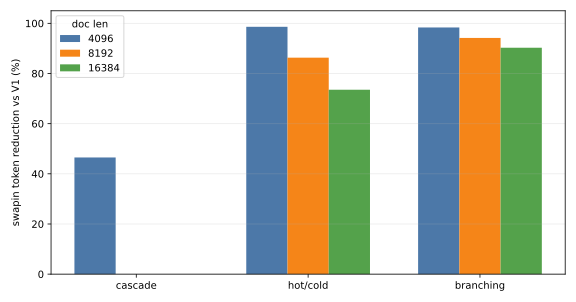
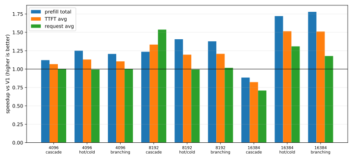
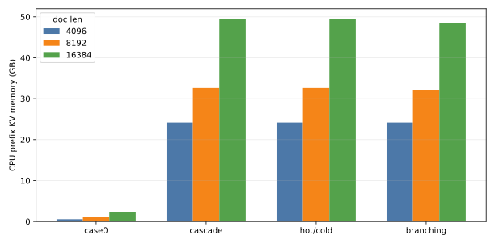

# nano-vLLM GPU+CPU Prefix Cache 进展

## 研究方向

目标：把 nano-vLLM 现有 GPU prefix cache 扩展为 GPU + CPU 两级 prefix cache。

请求查找 prefix KV 时：

```text
GPU hit              -> 直接复用 GPU KV
GPU miss + CPU hit   -> H2D restore 到 GPU，跳过 prefix prefill
GPU miss + CPU miss  -> 正常 prefill / recompute
```

约束：模型权重始终完整驻留 GPU，只人为限制 GPU KV cache capacity；第一阶段不考虑 SSD、不引入 ShareGPT、不把 preemption-driven swapping 作为主实验。

实现上需要贴合 nano-vLLM 当前 block 抽象：`BlockManager` 管理的是 logical block，一个 logical block id 对应所有 layer 的 K/V slice。

```text
kv_cache shape = [K/V][layer][block_id][token_offset][kv_head][head_dim]
Qwen3-8B: 1 logical block = 256 tokens = 36 MiB 全层 KV
```

## 环境

```text
GPU: NVIDIA H200 NVL
Model: /data/datasets/models-hf/Qwen3-8B
venv: .venv-fa28
Python: 3.10.19
Torch: 2.8.0+cu128
FlashAttention: 2.8.3.post1
```

说明：`.venv-fa28` 中已有匹配的 `flash-attn` wheel，后续 benchmark 优先使用该环境，避免本地编译。

## 代码入口

```text
bench_long_doc_qa.py
scripts/run_prefix_cache_cases.sh
```

`bench_long_doc_qa.py` 负责生成 synthetic long-doc / branching workload，并输出 JSON metrics。`scripts/run_prefix_cache_cases.sh` 负责批量跑 baseline / V1 / V2，并为每个 case 生成 `summary.json`。

## V1 实现

V1 已实现 CPU prefix cache backing store，重点是 correctness 和可观测性。

核心路径：

- prompt prefill 完成后，完整 prefix blocks 立刻 async D2H 写回 CPU。
- decode 新生成 tokens 暂不主动纳入 prefix cache；后续请求重新 prefill 成完整 block 后再进入 cache。
- 写回前用 block hash + token ids 去重：CPU 已有或正在 pending writeback 时跳过。
- waiting request 调度时查最长连续 prefix：GPU hit 直接复用，CPU hit 分配 GPU block 并同步 H2D restore，miss 后剩余 token 正常 prefill。
- pending writeback 的 GPU block 会被保护，D2H 完成后再释放；V1 选择优先保证正确性。

已验证 smoke test：

| 场景 | 结果 |
|---|---|
| 重复 prompt 写回 | 第二次请求不会重复 D2H，同一 prefix block 写回去重生效 |
| `D0 -> D1 -> D0` 小 GPU cache | 第三次 `D0` GPU miss + CPU hit，可 H2D restore 并跳过 prefix prefill |

## V2 实现：GPU LRU Retention

V2 已实现。它不做调度感知预取，目标是把 V1 中“request 结束后 GPU KV 是否还能复用”的随缘行为，改成明确的 inactive GPU prefix cache policy。

核心语义：

```text
active block   = 正在被 running / waiting request 引用，不能淘汰
inactive block = request 已结束或释放引用，KV 仍在 GPU，hash 仍有效，可作为 GPU prefix cache 命中
free block     = 没有有效 cache 内容，或已经被 LRU eviction 选中可覆盖
```

V2 路径：

- request prefill 完成后仍按 V1 主动 async D2H 写回 CPU backing。
- request finish 后，完整 prefix blocks 不立刻进入普通 free list，而是进入 inactive GPU LRU。
- 释放同一个 request 的 blocks 时按逆序入队：tail prefix 先进入 LRU/free queue，在相同 recency 下更早被淘汰；靠近 prefix 根部的 block 更通用，因此尽量留久一点。这个策略对齐 vLLM 的 prefix-aware LRU 细节。
- 新 request prefix lookup 时，如果命中 inactive block，则从 LRU 中移出并重新变成 active GPU hit。
- 需要新 GPU block 时，优先使用真正空闲 block；不够时从 inactive LRU 端驱逐 victim；仍不够时才进入现有 preemption 路径。
- eviction 优先选择已经 CPU-backed 的 inactive block；没有 CPU backing 的 inactive block 只有在空间仍不足时才被淘汰。
- pending writeback 已改成 block 粒度：已完成 D2H 的 block 可以先进入 CPU-backed LRU/可淘汰集合，未完成 D2H 的 block 继续 protected。

V2 重点指标：

```text
gpu_prefix_miss_request_count
cpu_sync_swapin_request_count
cpu_sync_swapin_block_count
cpu_sync_swapin_token_count
cpu_prefix_restore_latency_sum
gpu_lru_hit_block_count
gpu_lru_hit_token_count
gpu_lru_eviction_count
gpu_lru_cached_block_count
gpu_lru_cached_block_peak
```

预期收益：相比 V1，V2 不是 overlap H2D，而是减少同步 swapin 次数、H2D bytes 和 H2D latency，同时提升 GPU prefix reuse。

## V3 设计：内存感知 Lazy Writeback

V3 在 V2 LRU 上只做一个优化：memory-aware selective writeback。

核心变化：不再 prefill 后全量写回 CPU，而是只给最可能被回收的 inactive GPU blocks 做 lazy D2H。动机是 CPU cache 也有限，V1/V2 的全量 backing 会让大量“GPU 上已经保留、短期不需要 CPU 副本”的 KV 占住 CPU 空间，反而挤掉更有价值的 prefix，甚至迫使它们被丢弃或下沉到更慢层级。V3 希望把 CPU 空间优先留给即将失去 GPU 副本、且未来仍可能复用的 KV，同时减少不必要的 PCIe D2H 流量。

Lazy writeback 的触发时机参考 vLLM simple CPU offload：每个 scheduler iteration 完成 scheduling/allocation 后，在 connector metadata 构建阶段统一检查一次，而不是某个 block 被 allocate 时立刻 D2H。

```text
scheduler step
  -> allocation / scheduling
  -> build_connector_meta(scheduler_output)
  -> prepare_store_specs()
  -> _prepare_lazy_store_specs()
  -> 扫描 GPU inactive/free 队列前沿
  -> 批量挑选 blocks 异步写回 CPU
```

核心阈值也参考 vLLM，不写死固定 block 数，而是按单轮 scheduler step 可能新增的最大 KV blocks 估算 safety window：

```text
target_blocks = ceil(max_num_batched_tokens / block_size)
target_free   = target_blocks * (1 + lazy_writeback_watermark_ratio)
```

vLLM 当前 lazy CPU offload 使用 `lazy_writeback_watermark_ratio = 1.0`，即大约保留 `2 * ceil(max_num_batched_tokens / block_size)` 个 already-backed inactive/free blocks。我们的场景里 `max_num_batched_tokens` 可能为了长 prompt 设得偏宽，直接用 `1.0` 会比较激进，容易提前复制过多 KV 到 CPU。因此 V3 不再只看单个默认值，而是把 watermark 当成实验变量。

当 already-backed window 不足时，从 inactive LRU 的 eviction end 选择 GPU-only blocks，批量异步 D2H。这样 GPU 需要腾空间时，可以优先淘汰 already-backed blocks，避免在关键路径上同步 D2H；同时又不会像 V1/V2 那样把所有 prefix 都常驻 CPU。

V3 block 状态：

```text
active GPU                -> running/waiting request 正在引用
inactive GPU only         -> 可 GPU hit，但还没有 CPU backing
inactive GPU + CPU backed -> 可 GPU hit，也可无痛 evict GPU
pending writeback         -> D2H 未完成，暂时不能覆盖
CPU only                  -> GPU miss 后可 demand restore
dropped                   -> CPU/GPU 都没有，后续只能 recompute
```

需要新增配置：

```text
lazy_writeback_watermark_ratio = 0.5
cpu_prefix_cache_gb_limit
```

后续扫描 `lazy_writeback_watermark_ratio = 0 / 0.25 / 0.5 / 1.0`。`0` 只覆盖一轮最大 allocation demand，`1.0` 对齐 vLLM 的 100% watermark；中间值用于观察 CPU 占用和同步 swapin 的折中。暂不把 `2.0` 作为主扫描点，除非需要专门验证更保守窗口对 sync swapin 的上限收益。

关键指标：

```text
inactive_cpu_backed_block_count
inactive_gpu_only_block_count
victim_window_safe_or_pending_block_count
lazy_writeback_scheduled/completed_block_count
evict_already_backed_block_count
evict_gpu_only_sync_writeback_block_count
evict_gpu_only_drop_block_count
cpu_cache_evicted_block_count
cpu_prefix_kv_gb / cpu_prefix_kv_gb_peak
```

V3 的 benchmark 不只看速度，还要看 memory-latency tradeoff：在相同 cache pressure 下，扫描 `lazy_writeback_watermark_ratio` 和 `cpu_prefix_cache_gb_limit`，找到 CPU memory 明显低于 V2、但 sync swapin / TTFT / request latency 接近 V2 的参数区间。`cpu_prefix_cache_gb_limit = 0` 表示不限制 CPU cache，用作上界对照。

专用脚本：

```text
scripts/run_v3_memory_sweep.sh
```

默认扫描 `watermark = 0 / 0.25 / 0.5 / 1.0` 和 `CPU limit = 3 / 5 / 7 / unlimited GB`。本轮不再做 document length sweep，优先固定 `document_length = 8192`；同时把 `target_working_set_gb` 和 `gpu_kv_cache_gb` 等比例放大到 `12.0 / 4.8`，保持 working set/GPU 约 `2.5x`、单 prompt/GPU 约 `24%`。这样 cache pressure 主要来自更多 documents，而不是少量超长 request。

## V4 设计：调度感知 Prefetch / OPT Eviction

V4 再引入 scheduler-aware 优化，不和 V3 的内存优化混在一个版本里。

计划方向：

- scheduler inspect waiting/running 队列，提前恢复即将使用的 CPU-resident prefix，尽量把 H2D restore 从关键路径移走。
- eviction 从朴素 LRU 升级为近似 OPT：在当前可见调度窗口内，优先驱逐最晚才会再次访问、或不会再访问的 inactive block。
- `sync_swapin` 指标只统计 GPU miss、CPU hit、且预取没赶上导致仍在关键路径同步 H2D 的情况；预取成功不计入 sync swapin。
- 新增 prefetch accuracy 指标，例如 prefetch true positive、false positive、false negative，用于观察预取取多了还是取少了。

## Workload Cases

当前参考 LMCache Long-Document QA 的 workload 语义，但文档内容使用 synthetic token IDs。warmup 阶段访问所有 reusable prefixes，不计入最终指标；measured 阶段访问相同 prefix + 不同 query suffix。

| case | 目的 | 访问特征 |
|---|---|---|
| `case0_functional` | 单文档功能性校验 | 同一 document 做两次 QA，第二次应命中 GPU prefix cache |
| `cascade_tile` | 级联污染 / cache thrashing sanity | warmup `D0,D1,...`，query 再从 `D0` 开始；working set 大于 GPU cache 时容易连续 miss |
| `hot_cold_sharing` | 冷热 document prefix sharing | hot documents 高频访问，cold documents 低频访问；同时出现 GPU hit 和 GPU miss |
| `branching_prefix_sharing` | 分叉 request 部分共享 | 多个 branch 共享同一个 root prefix，同时各自有不同 branch suffix |

## V2 Benchmark 参数原则

V2 LRU 要测的是 GPU inactive prefix cache 是否能减少 CPU swapin，而不是单个超长 request 把 GPU KV 撑爆。因此后续主实验按下面原则调参：

大白话：用更多不同 document 扩大总 working set，同时降低单个 request 的 KV 占比。不要主要依赖少量超长 document 制造 cache pressure。

需要同时控制两个比例：

```text
single_prompt_KV / GPU_KV
working_set_KV / GPU_KV
```

含义：

- `single_prompt_KV / GPU_KV`：一个 request 的 prompt/query/decode 最多占多少 GPU KV。它决定 continuous batching 是否还有空间、inactive LRU 是否有空间留住历史 prefix。目标先放在 `0.25-0.4`。
- `working_set_KV / GPU_KV`：所有可复用 document prefix 的总 KV 量相对 GPU KV cache 的大小。它决定是否有长期 cache pressure。目标先放在 `2-4`。

调参顺序：

1. 固定 `document_length >= 4096`，但避免单个 prompt 占据 GPU KV 的大部分。
2. 根据目标 `single_prompt_KV / GPU_KV` 选择 `gpu_kv_cache_gb`。
3. 根据目标 `working_set_KV / GPU_KV` 自动计算 `num_documents`，优先增加 document 数量，而不是继续拉长 document。
4. 使用 Poisson arrival、`max_num_seqs=8`、合适的 `max_num_batched_tokens` 跑 serving 场景，确认确实在 continuous batching 下比较 recompute baseline 与 V2 LRU。

粗略公式：

```text
single_prompt_KV ~= (document_length + query_length + output_len) * kv_bytes_per_token
working_set_KV ~= num_documents * reusable_prefix_length * kv_bytes_per_token
```

当前参数检查：Qwen3-8B bf16 的 KV 约为 `144 MiB / 1K tokens`。旧版 `gpu_kv_cache_gb=1.1` 实际只有约 `1.09 GB` KV blocks，因此单请求占比偏高：

| document length | single prompt KV | single_prompt_KV / GPU_KV | 粗略可同时容纳完整 prompt 数 |
|---:|---:|---:|---:|
| 4096 | 0.578 GB | 0.53 | 1 |
| 6144 | 0.859 GB | 0.79 | 1 |
| 7680 | 1.070 GB | 0.98 | 1 |

这个配置可以触发 recompute/restore，但不适合作为 V2 LRU 主实验：GPU 几乎没有空间同时容纳 active requests 和 inactive prefix，LRU 会退化成频繁 swapin/swapout。

后续 benchmark 需要把 `num_documents` 作为由 working set ratio 自动推导的参数，而不是写死。`bench_long_doc_qa.py` 已在 JSON 中输出 `working_set_to_gpu_kv_ratio`、`single_prompt_to_gpu_kv_ratio` 和 `single_prompt_fit_count_est`，用于检查每轮参数是否落在目标范围。

建议先保留两个主档位：

| profile | 目的 | 建议参数 |
|---|---|---|
| `moderate_lru` | 干净验证 V2 LRU 是否减少同步 swapin | `document_length=4096`, `gpu_kv_cache_gb≈2.0`, `target_working_set_gb≈6.0`, `max_num_seqs=8`, `max_num_batched_tokens=4*(doc+query)`, `request_rate=0.5-1.0 req/s` |
| `serving_concurrency` | 更接近 serving 的 continuous batching + cache pressure | `document_length=4096/6144`, `gpu_kv_cache_gb≈4.0`, `target_working_set_gb≈12.0`, `max_num_seqs=8`, `max_num_batched_tokens=4*(doc+query)`, `request_rate` 做 sweep |

`moderate_lru` 的关键是单请求占比约 0.3，GPU 能同时放下多个 active prompt，并留下 inactive LRU 空间；`serving_concurrency` 则用更大的 GPU KV budget 承接并发，同时通过更多 documents 维持 `working_set_KV / GPU_KV ~= 3`。旧版 `gpu_kv_cache_gb=1.1, target_working_set_gb=1.5` 只保留为 capacity-pressure sanity，不作为 V2 主实验配置。

## 实验结果

### V2 LRU Doc Length Sweep

本轮结果目录：

```text
exp/cpu_kv_memory_doclen_sweep_20260901_095444/
```

目的：在 serving-style Poisson arrival 下，比较 V1 CPU offload 与 V2 GPU LRU retention，并补充 CPU prefix cache 内存占用。按照你的要求，本轮跑完 16K 后停止；这轮不包含 recompute baseline，主要看 `V2 vs V1`。

定位更新：这轮 doc length sweep 更适合作为 prefix length sensitivity / sanity，不再作为后续主实验变量。后续主实验应固定 document length 和 GPU KV budget，通过改变 `working_set_KV / GPU_KV` 来扫描 cache pressure。

基础配置：

```text
model = /data/datasets/models-hf/Qwen3-8B
runs = 2
document_length = 4096 / 8192 / 16384
query_length = 96
output_len = 16
gpu_kv_cache_gb_requested = 24
max_num_seqs = 8
request_rate = 2 req/s
arrival_mode = poisson
```

`max_num_batched_tokens` 随输入长度放大：4K/8K 使用 `33152`，16K 使用 `65920`，约等于一次允许 4 个长 prompt 的 prefill batch。

图表：







CPU 内存图使用 `cpu_prefix_kv_gb.mean`，即 2 次运行的最终 CPU prefix cache 占用均值。当前实现 measured 阶段不释放 CPU backing，因此该值基本也等同于 `cpu_prefix_kv_gb_peak.mean`，不是时间平均内存。

参数检查：

| doc | case | docs/branches | CPU KV GB | WS/GPU | single prompt GB | single/GPU | fit count |
|---:|---|---:|---:|---:|---:|---:|---:|
| 4096 | case0 | 1 | 0.562 | 0.02 | 0.578 | 2.4% | 41 |
| 4096 | cascade | 43 | 24.188 | 1.01 | 0.578 | 2.4% | 41 |
| 4096 | hot/cold | 43 | 24.188 | 1.01 | 0.578 | 2.4% | 41 |
| 4096 | branching | 85 | 24.188 | 1.01 | 0.578 | 2.4% | 41 |
| 8192 | case0 | 1 | 1.125 | 0.05 | 1.140 | 4.8% | 21 |
| 8192 | cascade | 29 | 32.625 | 1.36 | 1.140 | 4.8% | 21 |
| 8192 | hot/cold | 29 | 32.625 | 1.36 | 1.140 | 4.8% | 21 |
| 8192 | branching | 56 | 32.062 | 1.34 | 1.140 | 4.8% | 21 |
| 16384 | case0 | 1 | 2.250 | 0.09 | 2.265 | 9.4% | 10 |
| 16384 | cascade | 22 | 49.500 | 2.06 | 2.265 | 9.4% | 10 |
| 16384 | hot/cold | 22 | 49.500 | 2.06 | 2.265 | 9.4% | 10 |
| 16384 | branching | 42 | 48.375 | 2.02 | 2.265 | 9.4% | 10 |

结论：8K/16K 的所有 case 都没有靠“单个 request 塞满 HBM”制造压力。16K 单 prompt 约 2.27GB，只占 24GB GPU KV 的 9.4%，估算可同时容纳约 10 个完整 prompt；cache pressure 主要来自更多 documents/branches 形成的总 working set。

核心结果均为 2 次运行均值。TTFT/request/queueing 是 measured requests 的 per-request 分布统计；`prefill total` 是 measured 阶段所有 prefill step 的总 wall time。

| doc | case | V1 swapin req/tok | V2 swapin req/tok | swapin token drop | V2 LRU hit tok | V1 TTFT avg/med/min | V2 TTFT avg/med/min | V1 req avg/med | V2 req avg/med |
|---:|---|---:|---:|---:|---:|---:|---:|---:|---:|
| 4096 | case0 | 1.0/4096 | 0.0/0 | 100.0% | 4096 | 0.101/0.101/0.101 | 0.076/0.076/0.076 | 0.537/0.537 | 0.451/0.451 |
| 4096 | cascade | 43.0/176128 | 43.0/94208 | 46.5% | 81920 | 0.091/0.087/0.073 | 0.086/0.082/0.066 | 0.521/0.510 | 0.520/0.512 |
| 4096 | hot/cold | 145.0/593920 | 2.0/8192 | 98.6% | 585728 | 0.089/0.085/0.064 | 0.079/0.074/0.061 | 0.520/0.509 | 0.523/0.502 |
| 4096 | branching | 283.0/871424 | 7.0/14336 | 98.4% | 858112 | 0.083/0.077/0.062 | 0.075/0.070/0.060 | 0.503/0.498 | 0.502/0.489 |
| 8192 | case0 | 1.0/8192 | 0.0/0 | 100.0% | 8192 | 0.101/0.101/0.101 | 0.076/0.076/0.076 | 0.476/0.476 | 0.450/0.450 |
| 8192 | cascade | 29.0/237568 | 29.0/237568 | 0.0% | 0 | 0.162/0.158/0.090 | 0.122/0.107/0.087 | 0.872/0.832 | 0.567/0.550 |
| 8192 | hot/cold | 95.0/778240 | 13.0/106496 | 86.3% | 667648 | 0.107/0.098/0.064 | 0.089/0.079/0.061 | 0.575/0.548 | 0.578/0.508 |
| 8192 | branching | 179.5/1091584 | 16.0/63616 | 94.2% | 1036160 | 0.094/0.088/0.063 | 0.078/0.073/0.060 | 0.522/0.519 | 0.513/0.494 |
| 16384 | case0 | 1.0/16384 | 0.0/0 | 100.0% | 16384 | 0.128/0.128/0.128 | 0.077/0.077/0.077 | 0.505/0.505 | 0.456/0.456 |
| 16384 | cascade | 22.0/360448 | 22.0/360448 | 0.0% | 0 | 0.205/0.179/0.145 | 0.249/0.232/0.146 | 0.895/0.917 | 1.264/1.074 |
| 16384 | hot/cold | 71.0/1163264 | 20.0/307840 | 73.5% | 920960 | 0.152/0.139/0.074 | 0.100/0.081/0.061 | 0.756/0.756 | 0.578/0.511 |
| 16384 | branching | 131.0/1585152 | 19.0/154240 | 90.3% | 1516928 | 0.119/0.114/0.063 | 0.079/0.074/0.061 | 0.590/0.550 | 0.501/0.499 |

| doc | case | V1 prefill total | V2 prefill total | speedup | V1 queue avg/max | V2 queue avg/max |
|---:|---|---:|---:|---:|---:|---:|
| 4096 | case0 | 0.069s | 0.048s | 1.43x | 0.000/0.000s | 0.000/0.000s |
| 4096 | cascade | 1.938s | 1.728s | 1.12x | 0.010/0.045s | 0.011/0.039s |
| 4096 | hot/cold | 7.541s | 6.031s | 1.25x | 0.011/0.045s | 0.010/0.049s |
| 4096 | branching | 13.884s | 11.510s | 1.21x | 0.010/0.049s | 0.009/0.043s |
| 8192 | case0 | 0.074s | 0.049s | 1.52x | 0.000/0.000s | 0.000/0.000s |
| 8192 | cascade | 2.203s | 1.782s | 1.24x | 0.022/0.089s | 0.015/0.072s |
| 8192 | hot/cold | 6.579s | 4.679s | 1.41x | 0.012/0.065s | 0.012/0.056s |
| 8192 | branching | 10.785s | 7.828s | 1.38x | 0.011/0.056s | 0.010/0.040s |
| 16384 | case0 | 0.100s | 0.050s | 2.02x | 0.000/0.000s | 0.000/0.000s |
| 16384 | cascade | 2.141s | 2.420s | 0.88x | 0.028/0.082s | 0.033/0.100s |
| 16384 | hot/cold | 7.432s | 4.319s | 1.72x | 0.016/0.089s | 0.012/0.094s |
| 16384 | branching | 10.865s | 6.109s | 1.78x | 0.014/0.087s | 0.010/0.043s |

观察：

- V2 不降低 CPU prefix cache 容量需求；CPU KV GB 基本等于 unique reusable prefix working set。V2 的收益来自把一部分 V1 的关键路径同步 H2D restore 变成 GPU inactive LRU hit。
- document length 越长，单个 prefix 占用的 GPU KV 越大，LRU 能同时保留的完整历史 prefix 数量越少。当前 24GB GPU KV 下，4K/8K/16K 单 prompt 约为 `0.58/1.14/2.27GB`，估算可容纳完整 prompt 数从 `41 -> 21 -> 10` 下降，所以长 prefix 下 swapin token reduction 变小是预期现象。
- `hot/cold` 和 `branching` 是 V2 的主目标场景。随着 prefix 拉长到 16K，V2 仍能把同步 swapin tokens 分别降低 `73.5%` 和 `90.3%`。
- `cascade` 是边界 case：8K/16K 下 V2 LRU hit 为 0，说明纯顺序 tile/thrashing 访问没有 temporal locality，朴素 LRU 解决不了；这个 case 更适合保留为 sanity / stress，而不是证明 V2 收益。
- queueing latency 整体较低，说明这轮不是旧版一次性批量提交造成的大排队。TTFT 的改善主要来自减少关键路径 restore；request latency 改善较小，因为短输出 decode 仍占相当比例。
- 4K 的 working set 约等于 GPU KV，压力偏轻；8K/16K 的 working set/GPU 分别约 `1.34-1.36x` 和 `2.02-2.06x`，更适合作为后续主结果。

## 下一步

1. 后续主实验改成 cache pressure sweep：固定 `document_length = 8192`、`gpu_kv_cache_gb`、`query_length`、`output_len`、`max_num_seqs` 和 arrival rate，只调整 `num_documents`，扫描 `working_set_KV / GPU_KV`，例如 `0.5x / 1x / 2x / 3x / 4x`。
2. `document_length` 不作为主变量，只保留少量 8K/16K sensitivity 点，用来说明 prefix 越长时单次 miss/restore 成本更高。
3. 继续保留 `case0_functional`、`cascade_tile`、`hot_cold_sharing`、`branching_prefix_sharing`，其中性能主张主要来自 hot/cold 和 branching；cascade 作为 LRU 无效边界 case。
4. 下一轮如需补 recompute baseline，应在相同 Poisson arrival、`max_num_seqs=8`、`max_num_batched_tokens` 和 GPU KV 参数下重跑，避免和旧版拥塞口径混用。
5. V3 聚焦 memory-aware selective/lazy writeback；重点扫描 `lazy_writeback_watermark_ratio` 与 `cpu_prefix_cache_gb_limit`，观察 CPU memory、sync swapin、recompute 和 TTFT 的权衡。
6. V4 再做 scheduler-aware prefetch / OPT eviction，并补充 prefetch true/false positive、false negative 等准确性指标。
